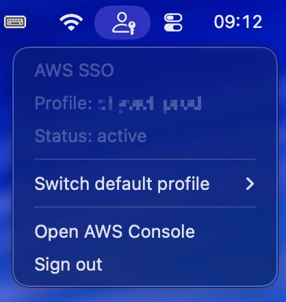

# SwiftBar AWS SSO Status

AWS SSO session status in your macOS menu bar — sign in, switch profiles, and open the Console without touching a terminal.



## Features

**Session status at a glance** — the cloud icon fills when your session is active and shows an × when it expires.

**Sign in / Sign out** — clicking **Sign in** opens the browser SSO flow only if your session is actually expired; **Sign out** ends it immediately.

**Open AWS Console** — jumps to the SSO start URL for the active profile directly in your browser.

**Profile switching** — the **Switch default profile** submenu lets you pick any SSO profile from `~/.aws/config`. The `[default]` block is rewritten automatically, so every subsequent `aws` command picks it up without `--profile`.

**Smart notifications** — notified on login, logout, profile switch, and expiration. The expiration alert includes a one-click **Renew** button (requires [`alerter`](https://github.com/vitorgalvao/alerter)).


## Requirements

- macOS with [SwiftBar](https://github.com/swiftbar/SwiftBar) (`brew install --cask swiftbar`)
- [AWS CLI v2](https://docs.aws.amazon.com/cli/latest/userguide/getting-started-install.html) (`brew install awscli`)
- Python 3 (ships with macOS Command Line Tools)
- An `~/.aws/config` already configured with one or more SSO profiles (see [AWS docs](https://docs.aws.amazon.com/cli/latest/userguide/cli-configure-sso.html))
- *(Optional)* [`alerter`](https://github.com/vitorgalvao/alerter) for notifications with clickable action buttons (`brew install vitorgalvao/tiny-scripts/alerter`). Without it, the plugin falls back to plain `osascript` notifications and the **Renew** action button is unavailable.

## Install

```bash
git clone https://github.com/<your-user>/swiftbar-aws-sso-status.git
cd swiftbar-aws-sso-status
./install.sh
```

The installer will ask for:

1. The SwiftBar plugins directory (auto-detected from `defaults read com.ameba.SwiftBar PluginDirectory`).
2. The install mode:
   - **symlink** *(recommended)* — creates a symlink in the plugins folder. `git pull` updates the live plugin instantly.
   - **copy** — copies a snapshot to the plugins folder; the repo and the live plugin diverge.

Non-interactive examples:

```bash
./install.sh --symlink --yes                            # accept defaults
./install.sh --copy --plugins-dir ~/.swiftbar-plugins   # explicit snapshot install
```

After installation, open SwiftBar (`open -a SwiftBar`) and trigger **Refresh all** — the cloud icon should appear within a minute.

## Uninstall

```bash
./uninstall.sh           # remove plugin only, keep state files
./uninstall.sh --purge   # also delete state files in ~/.aws/
```

## How it works

SwiftBar runs `aws-sso-status.py` every minute (schedule declared via the `<swiftbar.schedule>` metadata tag). Each tick:

1. **Instant render**: the menu is drawn immediately from the last cached state (`$SWIFTBAR_PLUGIN_CACHE_PATH/state`), so the menu bar never waits on a network call.
2. **Background check**: if the previous STS check is older than ~55s, a subprocess is spawned to run `aws sts get-caller-identity --profile <profile>` (8s timeout) and update the cache.
3. **State transition**: when the cached state changes (e.g. `ok → expired`), the subprocess fires a macOS notification and pings SwiftBar to refresh the menu bar (`swiftbar://refreshPlugin`).

The active profile is resolved by matching the contents of `[default]` in `~/.aws/config` against each `[profile <name>]` block. If `[default]` is empty, the env var `SWIFTBAR_AWS_PROFILE` is used; if neither is set, the first SSO profile in `~/.aws/config` is picked.

### Login flow

Clicking **Sign in** re-invokes the entry script with `login` as a parameter, which:

1. Re-checks `aws sts get-caller-identity` — if already valid, it just notifies and exits.
2. Otherwise runs `aws sso login --sso-session <session>` (preferred) or `aws sso login --profile <profile>` and opens the system browser.
3. Logs everything to `~/Library/Logs/swiftbar-aws-sso-status/plugin.log` and surfaces a macOS notification on success/failure.

When the cached state transitions `ok → expired`, the notification carries a **Renew** action button (requires `alerter`) that re-runs the login flow without having to open the menu.

### Logout

Clicking **Sign out** runs `aws sso logout` (10s timeout), records the new state in the cache, refreshes the menu bar, and fires a notification.

### Profile switching

Selecting a profile from the **Switch default profile** submenu **rewrites the `[default]` block in `~/.aws/config`** with the contents of `[profile <selected>]`, so any `aws ...` command without `--profile` uses the selected profile too.

The plugin runs an STS check immediately after the rewrite, fires a notification with the result (with a **Sign in** action button if not authenticated), and refreshes the menu bar without waiting for the next tick.

The first time the file is rewritten, `~/.aws/config.swiftbar.bak` is created as a one-shot safety backup.

## Files written outside the repo

| Path | Purpose |
| --- | --- |
| `$SWIFTBAR_PLUGIN_CACHE_PATH/state` | `ok` / `expired` from the last tick (used to detect transitions) |
| `$SWIFTBAR_PLUGIN_CACHE_PATH/last-check` | Timestamp of the last STS check (throttles background refresh) |
| `~/Library/Logs/swiftbar-aws-sso-status/plugin.log` | Append-only log of login / logout / state transitions / notification events (rotated at 256 KiB, one `.old` backup) |
| `~/.aws/config.swiftbar.bak` | One-shot backup of `~/.aws/config` before the first profile-switch rewrite |

`$SWIFTBAR_PLUGIN_CACHE_PATH` is set by SwiftBar at runtime (typically `~/Library/Caches/com.ameba.SwiftBar/Plugins/<plugin>`).

## Configuration

| Env var | Effect |
| --- | --- |
| `SWIFTBAR_AWS_PROFILE` | Fallback profile when `[default]` isn't set in `~/.aws/config` |
| `AWS` | Absolute path to the `aws` binary (used when it's not on `PATH`) |
| `ALERTER` | Absolute path to the `alerter` binary (used when it's not on `PATH`) |

## Troubleshooting

- **Menu bar still shows the expired icon right after `aws sso login`** — give it 60 seconds (next tick) or hit **Refresh all** in SwiftBar.
- **`aws sso login` browser tab doesn't auto-close** — that's standard AWS CLI behavior. Closing the tab manually is fine; the plugin will detect the new session on the next tick.
- **No SSO profile detected** — verify `~/.aws/config` has either `sso_start_url` or a `sso_session = <name>` referencing a `[sso-session <name>]` block.

## License

[MIT](LICENSE)
